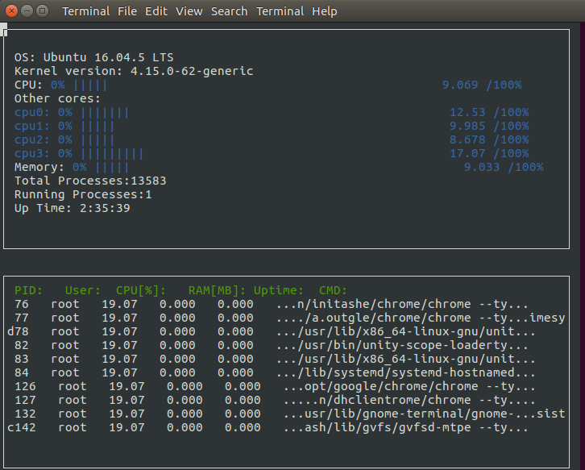

# CppND-System-Monitor

System Monitor is a Udacity project from the CppND. The starter code can be found [here](https://github.com/udacity/CppND-System-Monitor). The application built here will be used to monitor a UNIX sytem. To complete this program, I had to fill out the `ProcessParser` and `Process` classes.

## Output


## To setup and compile in Ubuntu 

1. Clone this repository
```
git clone https://github.com/Eyongkevin/Udacity-CppND-System-Monitor
```
3. Install `ncurses` package
```
sudo apt-get install libncurses5-dev libncursesw5-dev
```
4. Compile and run
```
g++ -std="c++17" main.cpp -lncurses
./a.out
```
Or
```
./make
```
5. In case of error that looks like the following: 
```
root@77e30fca8a01:/home/workspace/CppND-Object-Oriented# ./a.out
*** %n in writable segment detected ***
                                      Aborted (core dumped)
```
just keep trying `./a.out` and it should work eventually!

